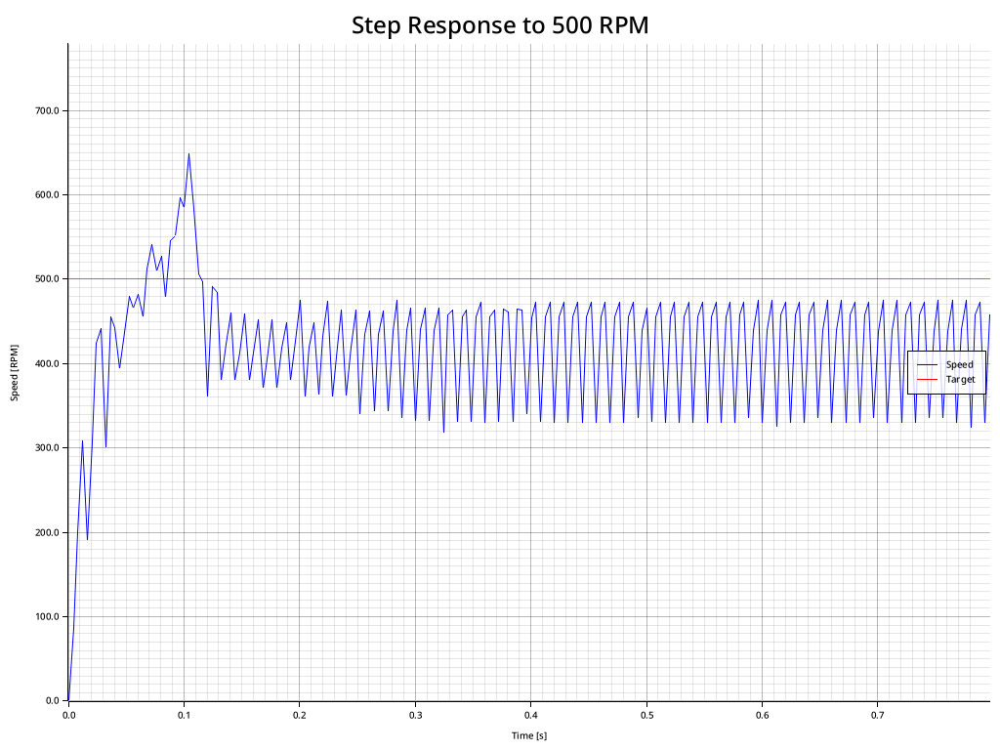
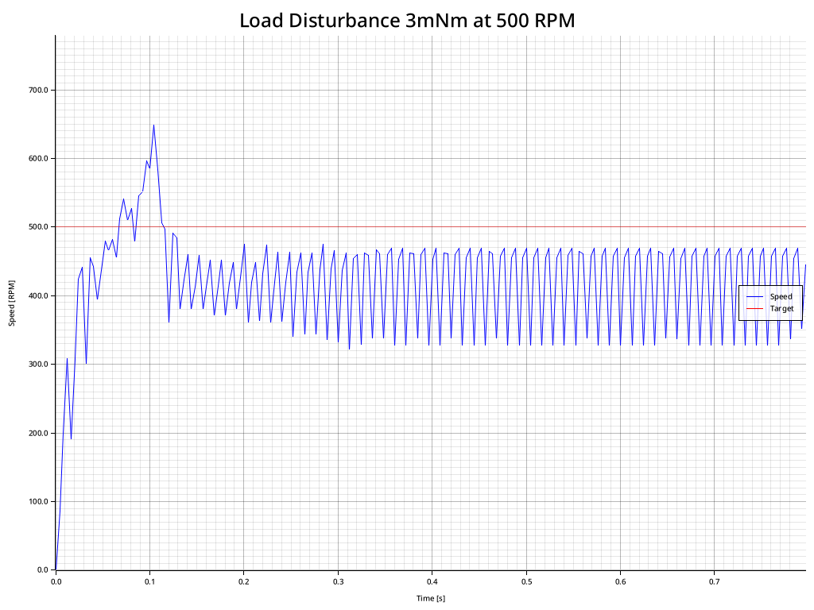
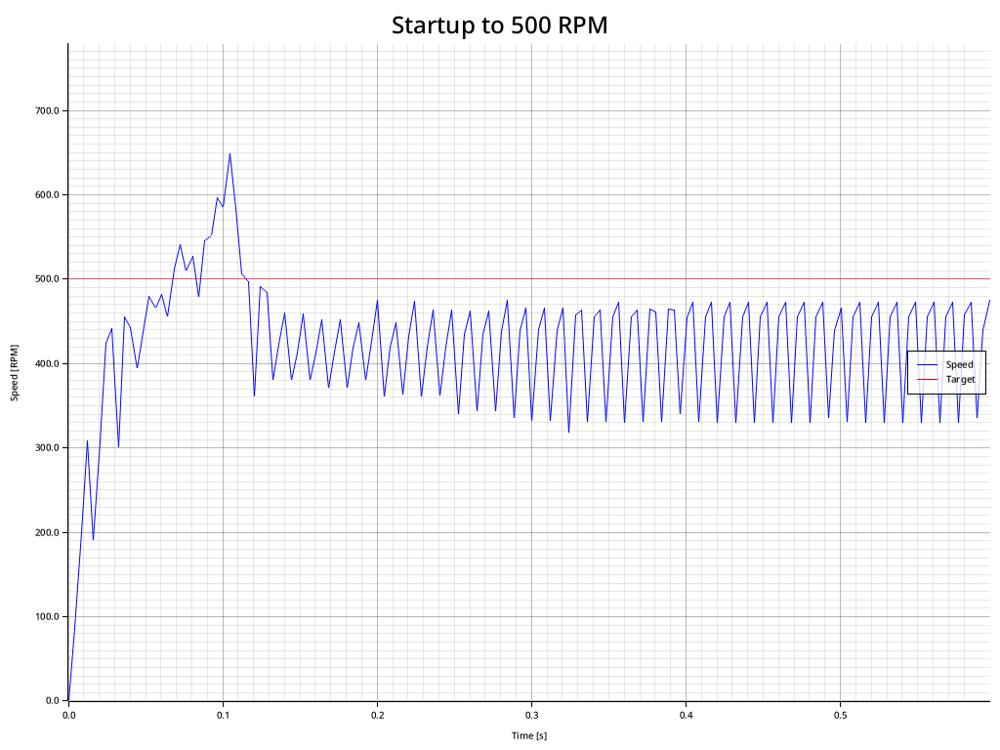
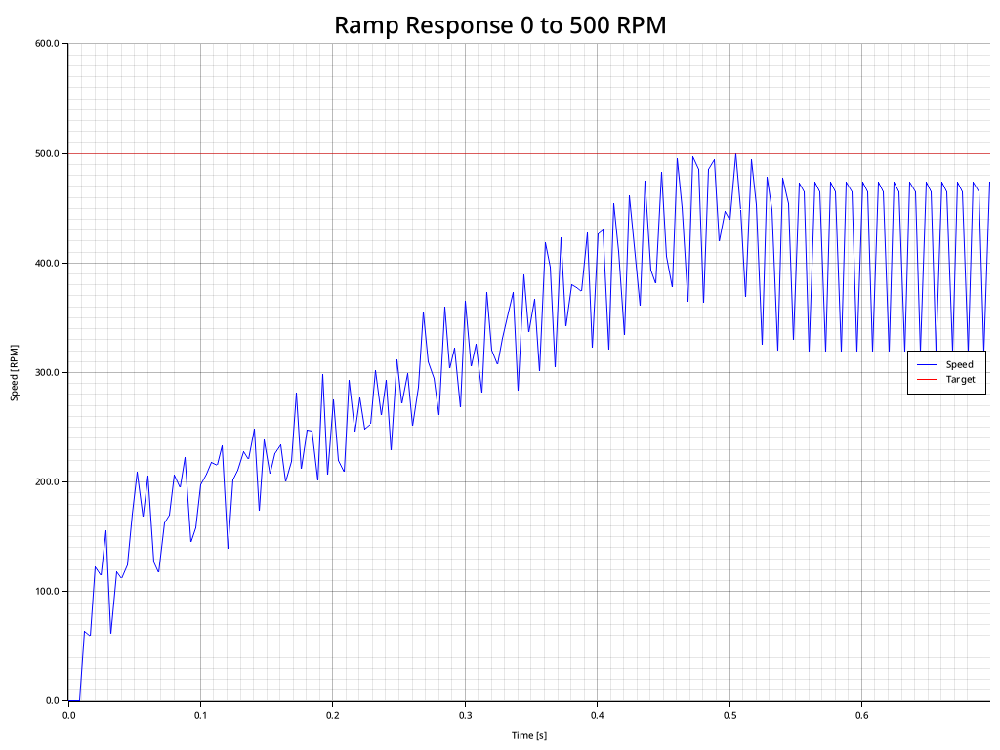

# g4-driver

BLDC Driver with STSPIN32G4

## Simulation Results

FOC制御シミュレーションの結果です。`bldc-sim`クレートで生成されます。

### Step Response (500 RPM)

### Load Disturbance Response

### Startup Response

### Ramp Response

## Documentation

- [STSPIN32G4 Datasheet (PDF)](https://www.st.com/resource/en/datasheet/stspin32g4.pdf)
- [STSPIN32G4 Product Page](https://www.st.com/en/motor-drivers/stspin32g4.html)
